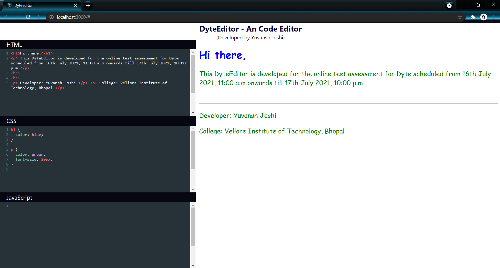

# DyteEditor - An Code Editor
###### for Html, Css and Javascript

DyteEditor is built with Pusher Channels and React.

## Screenshot

## How to get started with DyteEditor

1. Clone this repository and `cd` into it.
2. Execute `npm install` to download dependencies.
3. Open `client/src/App.js` and `.env` and update them with your Channels credentials.
4. Run `node server.js` to start the Express server.
5. `cd` into the client folder, run `npm install` followed by `npm start` to start the development server. Open http://localhost:3000 in your browser.

## Built With

- [React](https://reactjs.org)
- [Pusher Channels](https://pusher.com/channels)

## Developer
Yuvansh Joshi
LinkedIn - https://linkedin.com/in/yuvansh-joshi
Email - yuvansh.joshi2018@vitbhopal.ac.in
College - Vellore Institue of Technology, Bhopal